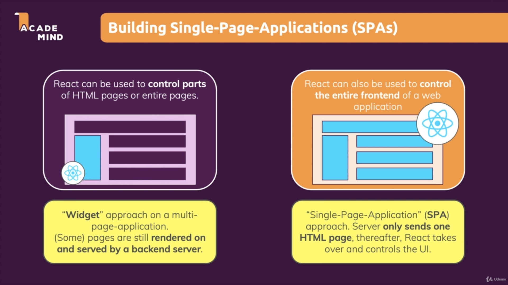

# React - The Complete Guide (incl Hooks, React Router, Redux)

---

## What is React

- A JavaScript library for building user interfaces - [React Official Website](https://reactjs.org)
- A client-side JavaScript library
- All about building modern, reactive user interfaces for the web
- Declarative, component-focused approach
- SPA/MPA Applications 

## BurgerBuilder-eclipse-VertX

Add instructions for project developers here.

## Order Payload

```json
{
  "orderId": "123",
  "orderDate": "2019-08-06T16:22:33",
  "price": 10.2,
  "customer": {
    "name": "Douglas",
    "email": "dbatista@mail.com",
    "deliveryMethod": "fastest",
    "street": "street no name",
    "zipcode": "22312"
  },
  "ingredient": {
    "salad": 1,
    "bacon": 1,
    "cheese": 0,
    "meat": 1
  }
}
```

## React v17 Complete Setup

```shell

npm i --save-dev @babel/cli @babel/core @babel/plugin-proposal-class-properties \
  @babel/plugin-proposal-export-default-from @babel/plugin-transform-runtime \
  @babel/preset-env @babel/preset-react babel-loader babel-plugin-module-resolver

npm i --save-dev eslint eslint-config-airbnb eslint-plugin-import eslint-plugin-jsx-a11y \
    eslint-plugin-node eslint-plugin-promise \
    eslint-plugin-react

npm i --save-dev css-loader file-loader html-loader react-hot-loader sass-loader \
    style-loader react-svg-loader url-loader

npm i --save-dev copy-webpack-plugin html-webpack-plugin mini-css-extract-plugin \
    sass node-sass

npm i --save-dev webpack webpack-cli webpack-dev-server

npm i redux redux-logger react-redux

npm i react react-dom

```

## Insert Ingredients

```javascript
db.getCollection("IngredientsCollection").insertOne({
  salad: 0,
  meat: 0,
  bacon: 0,
  cheese: 0,
});
```
